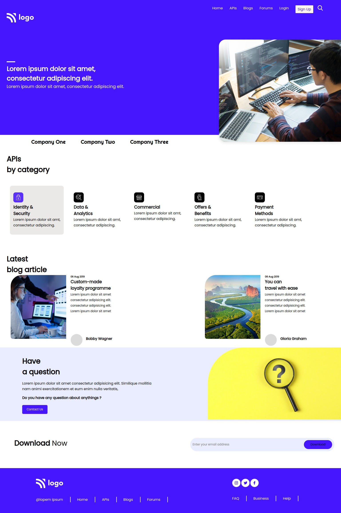

# This is static page 9
## This page is completely build with HTML and CSS(no framework)

### process 
 A thumbnail is given to us with html page and a blank CSS file .All the CSS page is written and designed  by me 

 ### total time to complete
 - took me around 3.5 hours to complete this page from scratch
### Main techniques learned during this project
-   background image position  
-   properly position background image
-   proper z index 
-   

 ## live link
 [LIVE LINK]("netlify")

 # RESULT
 ## my Result
 
 ## Given
